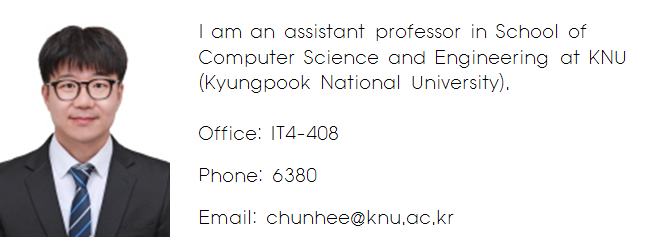

  

---

### Research Interests
My research interests include the following:
- Large-scale Data Processing
- Large-scale Data Analysis
- Knowledge-based System

---

### Education

###### Ph.D., Computer Science, KAIST, Jan. 2010
- Thesis Topic: Efficient Filtering, Storing and Query Processing Techniques in
RFID/USN Environments
- Adviser: Professor Chin-Wan Chung ([http://islab.kaist.ac.kr/chungcw](http://islab.kaist.ac.kr/chungcw))
###### B.S., Computer Science, KAIST, Feb. 2003 

---

### Experiences
##### Mar., 2016 - Feb. 2024 : Senior Researcher, ETRI (Electronics and Telecommunications Research Institute)
- Department: Visual Intelligence Research Section
- Projects:
  - Agent-Based Computational Demography (ABCD)
  - Digital Twin
  - Self-Improving Artificial Intelligence Technology.

##### May 20, 2014 - Feb. 1, 2016 : Research Follow, Nanyang Technological University
- Advisor: Professor Xiaokui Xiao
- Research Topics: Geo-social network data management
 
##### Apr. 2011 - Apr. 2014: Research Staff, SAIT (Samsung Advanced Institute of Technology), Samsung Electronics
- Department: Data Analytics Group, Intelligent Computing Lab.
- Projects:
  - Medical data analysis (Personal health record analysis and similar patient search)
  - Biological network data analysis (Graph clustering and search)

##### Feb. 2010 - Jan. 2011: Postdoctoral researcher, KAIST
- Advisor: Professor Chin-Wan Chung (Homepage: http://islab.kaist.ac.kr/chungcw)
- Research Topic: Graph Data Indexing
